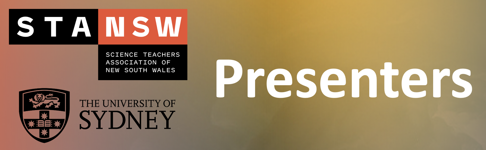

# Meet The Presenters

```{r, echo=FALSE}

```

## Reyne Pullen {.unlisted .unnumbered}

Dr Reyne Pullen is currently employed as an Education-focused lecturer in the School of Chemistry, University of Sydney. Recently awarded the 2021 RACI Chemistry Educator of the Year, Reyne has experience in delivering online and blended learning experiences, and designing course-level blended learning models, both at the tertiary level. Reyne has also worked within the secondary education sector, teaching both science and maths.

## Jody Moller {.unlisted .unnumbered}

Dr Jody Moller (Morgan) is an Education-focused lecturer in the School of Chemistry at the University of Sydney. Jody has been teaching chemistry at a tertiary level since 2004 and was awarded an Outstanding Contributions to Teaching and Learning (OCTAL) Award from the University of Wollongong in 2020. She has extensive experience in the use of modelling tools to enhance student learning in the online environment. Jody is also a qualified high school science teacher, completing her Graduate Diploma in Education in 2007.

## Shane Wilkinson {.unlisted .unnumbered}

Dr Shane Wilkinson is an Education-focused lecturer in the School of Chemistry, University of Sydney. He has a keen interest in the adoption of technology to enhance the way we teach and deliver chemistry in both classroom and laboratory environments. An example is augmented reality (AR) and how it can be used as a tool in education or as means of inclusivity for disadvantaged students in STEM subjects. Shane is also adept in the use of “teaching analytics” software to deliver personalised student experiences in large scale teaching environments. He also has a passion for laboratory pedagogy where he has extensive experience in designing remote, blended and practical laboratory coursework with a focus on authentic and/or competency-based laboratory assessments.

## Stephen George-Williams {.unlisted .unnumbered}

Dr Stephen George-Williams is an Education-focused lecturer based at the School of Chemistry, University of Sydney. His research has explored several areas including the purpose of the chemistry teaching laboratory, the relationships built between students and teaching assistants in the teaching laboratory, and the use of virtual reality (VR) to support teaching chemistry in the classroom.

## Tom Elton {.unlisted .unnumbered}

Mr Tom (Thomas) Elton is currently a computer and data science student at the University of Sydney. With a passion in technological innovations in education, he has recently enjoyed collaborating as a research assistant in the School of Chemistry (University of Sydney), where he is putting together a publicly available code package to easily generate 3D molecules in Unity. This aims to significantly speed up the development time when creating VR and AR interactive chemistry lessons.

