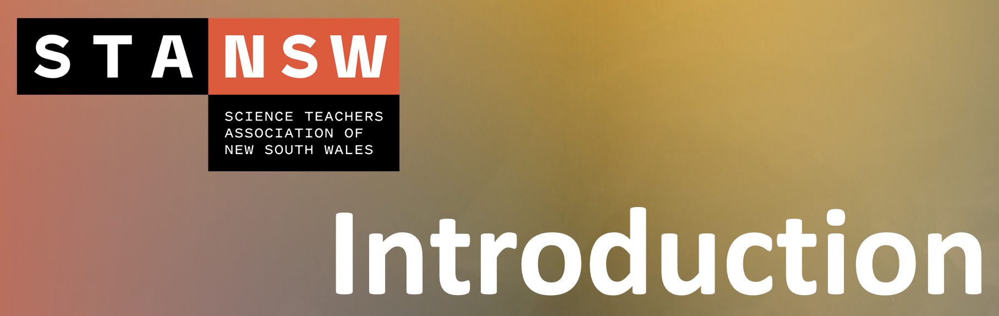

# Introduction

```{r, echo=FALSE}

```

## Introduction - Main Room {.unlisted .unnumbered}

> The session will begin with audience members sharing how they commonly represent and visualise 3D molecules in the classroom. The presenters will then briefly share three different ways of visualising 3D molecules that they find helpful.

<br>

- The lecture slides can be downloaded from [here](https://github.com/tjelton/STANSW-Stage-6-Conference-3D-modelling-session-2022/blob/main/Worksheets/Slides/2022%20STANSW%20ST6%203D%20Modelling%20Presentation.pdf).
- *The Padlet can be accessed [here (no longer avaialble)]().*
- PDF of Padlet Questions can be accessed [here](https://github.com/tjelton/STANSW-Stage-6-Conference-3D-modelling-session-2022/blob/main/Worksheets/Padlet/Padlet.pdf){target="_blank"} after the presentation.

## Breakout Rooms {.unlisted .unnumbered}

> After hearing of three different ways of visualising 3D molecules, audience members now get to choose one method for a more-indepth workshop.

<br>

- [Breakout Room 1](#Room-1): MolView, CheMagic & ChemTube3D - Jody Moller
- [Breakout Room 2](#Room-2): 3D Models in Microsoft Office and Avogadro - Shane Wilkinson
- [Breakout Room 3](#Room-3): Unity - Tom Elton


## Debrief - Main Room {.unlisted .unnumbered}

> The session will conclude with a debrief, as we come together one final time.

<br>

- [Debrief](#Debrief)
