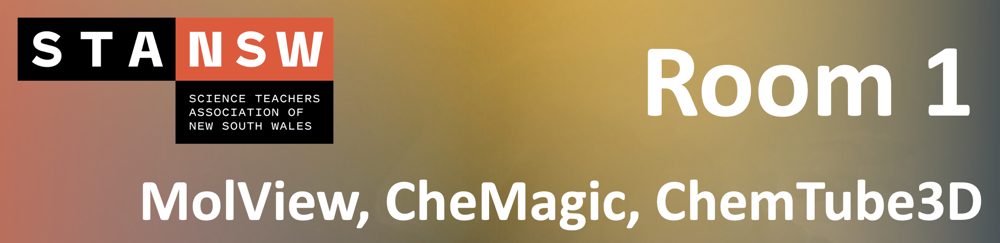

# Breakout Room 1 {#Room-1}

```{r, echo=FALSE}

```

**Presented by Dr Jody Moller**

<br>

Worksheet can be download [here](https://github.com/tjelton/STANSW-Stage-6-Conference-3D-modelling-session-2022/blob/main/Worksheets/Breakout%20Room%201/STANSW%20Stage6%20Worksheet%20-%20Breakout%201%20MOLLER.pdf){target="_blank"}!

<br>

Quick links:

- [MolView](https://molview.org/){target="_blank"}

- [CheMagic](https://chemagic.org/molecules/amini.html){target="_blank"}

- [ChemTube3D](https://www.chemtube3d.com/){target="_blank"}