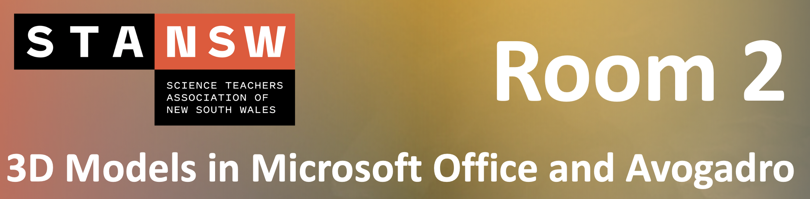

# Breakout Room 2 {#Room-2}

```{r, echo=FALSE}

```

**Presented by Dr Shane Wilkinson**

<br>

The Instructors worksheet can be downloaded [here](https://github.com/tjelton/STANSW-Stage-6-Conference-3D-modelling-session-2022/blob/main/Worksheets/Breakout%20Room%202/3D%20Molecule%20Workshop%20Instructions.pdf)!

A sample student worksheet can be downloaded [here](https://github.com/tjelton/STANSW-Stage-6-Conference-3D-modelling-session-2022/blob/main/Worksheets/Breakout%20Room%202/Sample%203D%20Worksheets.docx)!

<br>

Quick links:

- [Avogadro](https://avogadro.cc/)

- [Blender](https://www.blender.org/download/)
