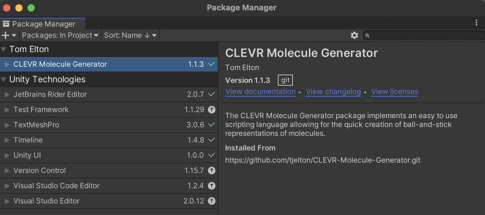

# Breakout Room 3 {#Room-3}

```{r, echo=FALSE}
knitr::include_graphics("images/Room_3.png")
```

**Presented by Tom Elton**

## Syllabus

> **Module 3: Reactive Chemistry.** Use modelling to demonstrate: the rearrangment of atoms to form new substances, the conservation of atoms in a chemical reaction.

> **Module 6: Acid/Base Reactions.** Construct models and/or animations to communicate the differences between strong, weak, concentrated and dilute acids and bases.

> **Module 7: Organic Chemistry.** Construct models, identify the functional group, and write structural and molecular formulae for homologous series of organic compounds, up to C8.

> **Module 7: Organic Chemistry.** Analyse the shape of molecules formed between carbon atoms when a single, double or triple bond is formed between them.

> **Module 7: Organic Chemistry.** Investigate, write equations and construct models to represent the reactions of unsaturated hydrocarbons when added to a range of chemicals.

> **Module 7: Organic Chemistry.** Investigate, write equations and construct models to represent the reactions of saturated hydrocarbons when substituted with halogens.

## Brief Overview

Thanks for coming along to this breakout room today!

We're going to be playing around with some software that I've been developing the last few months, which will fit nicely with modelling 3D molecules as part of the HSC syllabus.

Just so that we all know what's to come, here is a general breakdown:

1. What is this software?
2. Download Unity onto your personal laptops.
3. Download the 3D modelling software using GitHub.
4. Learn the basics of the scripting language to create 3D molecules.
5. Create some simple organic molecules.
6. (If time permits) Tom to share some advanced (and optional) features in the software.
7. (If time permits) The future of VR, and how it can be utilised in the classroom.

I think the biggest challenge is going to be getting Unity up and running, so let's jump straight on in!

<br>

## What is this software?

### What is Unity?

Unity is a cross-platform game engine which was designed to allow developers to easily create video games, especially games which involve the design of 3D worlds. If you've ever seen someone coding, it looks scary and intimidating - it sure does for me! Unity alleviates this by offering users a graphical user interface (GUI) which means developers can make huge applications with less coding - it's even possible to use close to no coding at all (making it ideal for students)! Because of this, Unity has gained widespread adoption. Whilst initially intended for game development (which is still by far its most widely used use-case), this powerful and intuitive engine is also used in the fields of architecture and film (see [Unity](https://unity.com/) for more info).

Because Unity can be used to design 3D worlds and spaces, it has become an ideal candidate for creating VR applications.

In the education realm, it is great because:

- It combines a GUI with coding, which results in a faster learning curve for students.
- It is free for students!
- Unity themselves designed [Unity Learn](https://learn.unity.com/?_gl=1%2A11o2hkj%2A_gcl_aw%2AR0NMLjE2MzY3MTY5ODMuQ2p3S0NBaUF2cmlNQmhBdUVpd0E4Q3M1bGFJenM2UXZhV2RxendXU3cwSUlFN3ZYLXBrLTgySU50QWRTTk5acEl4dThCUGZPMnBFeTFSb0M5ZDhRQXZEX0J3RQ..%2A_gcl_dc%2AR0NMLjE2MzY3MTY5ODMuQ2p3S0NBaUF2cmlNQmhBdUVpd0E4Q3M1bGFJenM2UXZhV2RxendXU3cwSUlFN3ZYLXBrLTgySU50QWRTTk5acEl4dThCUGZPMnBFeTFSb0M5ZDhRQXZEX0J3RQ..&_ga=2.83971225.1225568882.1643885899-337911776.1601136010), an excellent and comprehensive suite of tutorials, to help anyone get up and running in Unity.
- There is a comprehensive [Asset Store](https://assetstore.unity.com/) with many free assets which can be used in projects.
- There are many tutorials and YouTube videos online!

### What is the CLEVR Molecule Generator

As mentioned, Unity **IS NOT** a software developed just for science educators. This means that there are not convenient features to create 3D molecules.

Instead, if someone wanted to create a 3D molecule, they would have to undergo a very tedious process! The image below shows an example of creating a simple bond between two arbitrary elements. In order to create this, we would have to create two spheres, scale them, and then create a new cylinder, and then position this cylinder! Maybe you don't think this would take too long, but now consider that this would be one small part of a large molecule. Further, we only have one bond here, we haven't really paid much attention to the size of the molecules, and we also haven't even added colour yet (which is actually a little bit involved).

```{r, echo=FALSE}

```

The solution is the CLEVR Molecule Generator. The name "CLEVR" comes from Shane (aka the guy in breakout room 2), and stands for the 'Chemistry Language Education Virtual Reality'. The idea for this application originated from [Sebastian Dunn](https://sebdunn.com/), who is a VR guru from The University of Auckland.

The main intention for this software is to significantly speed up the development pipeline for those making software in Unity which utilise 3D molecules. It also turns out though, that this software lends itself well to visualing 3D molecules as part of the HSC syllabus. You can think of the software as a digital Molymod kit, except with this kit you don't have to worry about running out of carbons!

So, soon we will be able to create simple scripts like this...

```{r, eval=FALSE}
ELEMENTS {
    0, O, 0, 0, 0;
    1, H, 0.758602, 0.000000, 0.504284;
    2, H, 0.758602, 0.000000, -0.504284;
}

BONDS {
	0 - 1;
	0 - 2;
}
```

... which will result in cool outputs like this:

```{r, echo=FALSE}

```

> If you look at the script which was just shown, you'll notice that the numbers are highlighted in green, and everything else in black. This colour coding will not show up in Unity, rather is one of the perks of this digital document.

<br>

## Downloading Unity

Now, in confession, this is the part of the presentation that I'm least looking forward to... This is just because Unity is quite a large application, and so I'm expecting it could take a while (at least a few minutes) to download! Ideally, in a classroom setting you'd either have Unity already downloaded on the classroom desktops, or get the students to download it onto their laptops prior to class for homework. Regardless, lets dedicate a few minutes now to getting Unity downloaded.

You're going to want to go to this link [here](https://unity3d.com/get-unity/download). If you're reading this in a few years time, and this link no longer works, please just Google 'Download Unity'.

Now, click on the button which says, "Choose your Unity + download".

```{r, echo=FALSE}
knitr::include_graphics("images/Download.png")
```

Now, toggle to where it says "Individual". From there you'll either want to click on the blue button under the student or personal option (see below). I would personally suggest going for the personal one, just because I think it might be easier with high school students/teachers. For the rest of this tutorial, I'm going to presume that you pressed on the personal one, but it should be easy enough to follow the steps if you chose the student one!

```{r, echo=FALSE}

```

After clicking on the "Get started" button under the "Personal" section, you'll be taken to a new webpage. Scroll down, and look for text which says, "Create with Unity in three steps".

```{r, echo=FALSE}
knitr::include_graphics("images/Steps.png")
```

Follow steps 1 and 2 on the webpage (see the image above).

We'll now take a few minutes to get Unity downloaded!

> Struggled getting Unity downloaded during this session? I'm happy for you to email me at telt8898@uni.sydney.edu.au to have a 1-on-1 zoom at a later date. I'm also going to work on a resource to make these steps easier for students to follow. Once this sheet is done, I'll add it to the updates section at the very bottom of this page!

<br>

## Using GitHub to Download the CLEVR Molecule Generator

Okay, now we're going to move on! To progress through this next stage, it's presumed that you have downloaded the "Unity Hub".

First, open the "Unity Hub".

Next, we want to create our first project! Click on the blue button which says "New project".

```{r, echo=FALSE}

```

Per the image below, make sure to choose the template which says "3D", and also give the project an informative name, and be sure that you are saving it at a sensible location.

```{r, echo=FALSE}
knitr::include_graphics("images/Configure_Project.png")
```

Once this is done, press "Create" project, and wait for Unity to do it's magic!

Once this is done, you should see the project appear in your "Unity Hub". Click on the project to open it up. Once you've done this, Unity will open up a page, with an empty 3D scene.

```{r, echo=FALSE}

```

<br>

> Update: There is an intermediate step here that I didn't realise was required (oops)! You need to have GitHub installed on your computer for this installation to be successful - some of you may already have it installed (which is why I didn't mention it in this original tutorial)! For an installation guide for Mac, Windows and Linux, please see [here](https://www.atlassian.com/git/tutorials/install-git).

<br>

Now, in the project tab, click on the folder that says packages. Right click on this folder, and then navigate to the button which says "View in Package Manager". Click on this button.

```{r, echo=FALSE}

```

With the package manager open, there is a "+" symbol in the top left corner. Click on this button, and press the option which says "Add package from git URL...".

```{r, echo=FALSE}
knitr::include_graphics("images/Package_Manager_Window.png")
```

A text box will open just below the "+" symbol. Copy and paste this link into the text box: https://github.com/tjelton/CLEVR-Molecule-Generator.git

When you're done, press "Add".

```{r, echo=FALSE}
knitr::include_graphics("images/Git_Link.png")
```

Wait patiently as the package loads.

Once it's downloaded, it should appear in the package manager, like so:

```{r, echo=FALSE}

```

Congratulations! The package is now downloaded! :)

<br>

## Basics of the CLEVER Molecule Generator

> For this part of the presentation, we're going to do more of a live demo. Regardless, I'll put some brief notes here to help out! I'll also post a youtube link to this recording in the updates section at the bottom of this document, in case you want to re-watch the demo!

### Intro to the Interface - Creating a Default Molecule

First, how do we actually open the Molecule Generator? Move your mouse up to the top where the menu bar is, and you should see a tab which says "Tools". Clicking on this tab will open a drop down menu, where an option (probably the only option you have), will say "Molecule Generator". Click on this!

```{r, echo=FALSE}
knitr::include_graphics("images/Molecule_Generator_Button.png")
```

This will open up a new window which will look like this:

```{r, echo=FALSE}

```

Let's break down this interface!

- Folder Path: This is the path to the folder where your script is located.
- File Name: This is the file name of your script.
- Reset File Paths to Default: This resets the file paths to those that you see in the image above.
- Build: Builds the molecule pointer to by the folder path and file name.

Now, press "Build". This creates the molecule. The molecule that was just created can then be viewed in the "Assets" folder in the "Project" panel. Try dragging the molecule onto the scene.

You can move around the scene, or scale the molecule using the buttons in the top left corner:

```{r, echo=FALSE}

```

### Creating Your Own Molecule - Intro to the Scripting Language

Start by creating a new .txt file somewhere you will easily find it (I suggest doing this in the "Assets folder"). I've just created a new file called "new.txt":

```{r, echo=FALSE}

```

Double click on this new file to open it up. 'Visual Studio' should open displaying the empty file.

First, we want to write the following into our file:

```{r, eval=FALSE}
ELEMENTS {
  
  // Element definitions go here
  
}

BONDS {

  // Bond definitions go here
  
}
```

What does the above mean?

- Inside the ELEMENTS block we sepcify the elements that are going to appear in our 3D molecule.
- Inside the BONDS block we specify the types of bonds that will appear between elements.
- The // denotes a comment, and lines starting with a // are ignored when the script is interpreted.

Now, the best way to learn is by creating a sample molecule. Let's start by creating a water molecule. In order to do this, we need to know the coordinates in 3D space of the 2H's and the O in H2O. To do this we use the link [here](https://www.molcas.org/documentation/manual/node28.html).

When clicking on the link, we see that the:

- O has x,y,z coordinates all at 0.
- The first H has x = 0.758602, y = 0, and z = 0.504284.
- The second H has x = 0.758602, y = 0, and z = -0.504284.

Now, we need to input this information into the script.

The general form for a line in the ELEMENTS block is:

```{r, eval=FALSE}
index, element symbol, x cord, y cord, z cord; 
```

Note:

- "index" is an integer identifier for this current element. It must be unique for each element.
- "element symbol" is the letter of the element as it appears on the periodic table.
- "x cord" is the x coordinate of the element.
- "y cord" is the y coordinate of the element.
- "z cord" is the z coordinate of the element.
- The input line must be concluded with a semicolon.

Using this new found knowledge, our script for H2O becomes:

```{r, eval=FALSE}
ELEMENTS {
  
  // Element definitions go here
  0, O, 0, 0, 0;
  1, H, 0.758602, 0.000000, 0.504284;
  2, H, 0.758602, 0.000000, -0.504284;
  
}

BONDS {

  // Bond definitions go here
  
}
```

Now, we have to specify the bonds in the BONDS block.

The general form for a line in the BONDS block is:

```{r, eval=FALSE}
index element from     bond degree     index element to;
```

Note:

- "index element from" is the integer index (id) for the element the bond is leaving from.
- "index element to" is the integer index (id) for the element the bond is going to.
- "bond degree" is the degree of the bond. "-" denotes a single bond, "=" denotes a double bond, "#" deontes a triple bond.
- The input line must be concluded with a semicolon.

We obviously know that in H2O, there is a single bond between each hydrogen and the oxygen. Using this, and the scripting syntax, we fill in the BONDS block:

```{r, eval=FALSE}
ELEMENTS {
  
  // Element definitions go here
  0, O, 0, 0, 0;
  1, H, 0.758602, 0.000000, 0.504284;
  2, H, 0.758602, 0.000000, -0.504284;
  
}

BONDS {

  // Bond definitions go here
  1 - 0;
  2 - 0;
  
}
```

There you have it! We've created our first script!

To run our first script, we open the 'Molecule Generator' window. Now we have to change the "Folder path" and "File name" to point to the script that we just created.

For me, this means:

```{r, echo=FALSE}

```

Press build, and have a look at the new molecule that you created! Remember, the molecule will save to the "Assets" folder.

## Creating Simple Organic Molecules

Now it's your turn to try it out! To fit in with module 7, let's practice creating some organic molecules.

One challenge you may face is finding the x,y,z coordinates of element in the molecule you want to create. A great database to try out can be found [here](https://cccbdb.nist.gov/geom1x.asp).

> I'm putting together a database where I'm going to place lots of examples of molecules which have already been put together using the scripting language. This collection can be found [here](https://github.com/tjelton/CLEVR-Molecule-Generator-Library). I have plans to put together examples for every molecule a part of module 7.

## Discussion of Advanced Features

There are many more advanced features which we won't go into detail today. But here is a sneak peak! 

```{r, echo=FALSE}
knitr::include_graphics("images/Advanced_features.png")
```

Full documentation for these advanced features will be released shortly, and when I'll release it, I'll let you know in the "Updates" section at the bottom of this doc.

## The Future of VR in the Classroom

VR has the potential to improve students ability to visualise things which may otherwise be conceptually difficult.

Undergraduate students Zack Alloggia, Monique Curulli, Rose Ghalichi, Jack Hedges, Alex Keane and Emma Shewat from The University of Sydney put together some interactive VR simulations to help students visualise different reactions. In particular, and pertinent to Module 6, these students (with Zack Alloggia as programmer) created an excellent Acid-base Reaction simulation. They made this code available [here](https://github.com/mzx2088/SCDL1991-2021Sem2).

Additionally, [here](https://www.youtube.com/watch?v=WFYYQZtk0nE) is a YouTube demonstration of the application they created!

> Discussion question: What other VR applications would you like to see in the classroom?

## Updates

> This software is still being maintained and updated. As significant updates occur, they will be placed down here!

*Cool things to come!*
