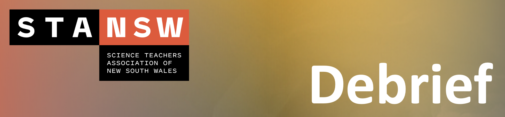

# Debrief {#Debrief}

```{r, echo=FALSE}

```

**A quick summary:**

- Free online modelling tools readily available for simple molecular visualisation
- Supplement to, not replacement of, of tactile tools
- Increase in coding embedded in the curriculum provides the ability to find solutions to more complex modelling problems

<br>

> The presenters would like to thank you for coming!