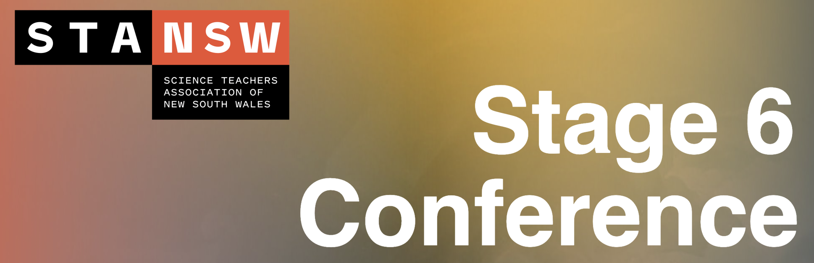

--- 
site: bookdown::bookdown_site
documentclass: book
link-citations: yes
github-repo: rstudio/bookdown-demo
---

# Abstract

## How can we utilise digital 3D modelling tools to support the development of chemistry students? {.unlisted .unnumbered}

```{r, echo=FALSE}

```

## Workshop Description {.unlisted .unnumbered}

One of the greatest hurdles in teaching chemistry has long been fostering the ability to move between symbolic representations, macro-level observations, and how atoms are arranged and interact at the molecular level. This skill underpins all aspects of chemistry and is one that benefits not only practicing chemists but also the broader population that our students will enter and contribute to.

As technology advances and becomes more accessible, opportunities are rapidly arising to better address this challenge with the use of 3D modelling software and applications. Across these tools, students are given the chance to build and view molecules in a 3D space and better understand how factors such as size, orientation, and electron density can contribute to properties and reactivity. This is not to say they are perfect solutions though! In this workshop, we will showcase a small number of promising tools that we have found useful in our own practice in addition to some future avenues that could add further value. We expect participants will gain exposure to some new tools they could utilise, share their own experiences or tools they currently use, and participate in a rich discussion of approaches to this challenge.

**Presenters:** Jody Moller^a^, Shane Wilkinson^a^, Tom Elton^a^, Stephen George-Williams^a^, Reyne Pullen^a^.

**Location:** Online.

**Time:** Thursday 23rd June 2022, 4:25pm.

^a^School of Chemistry, The University of Sydney, Sydney NSW, Australia
